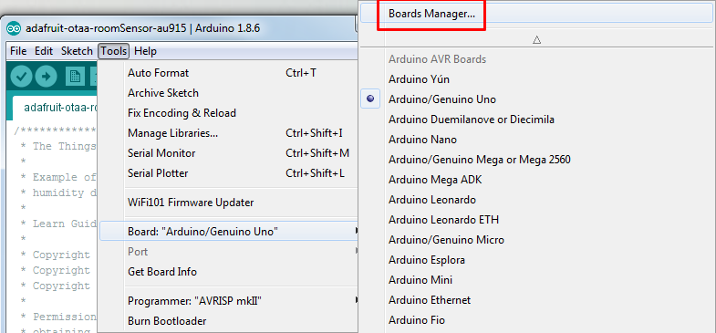
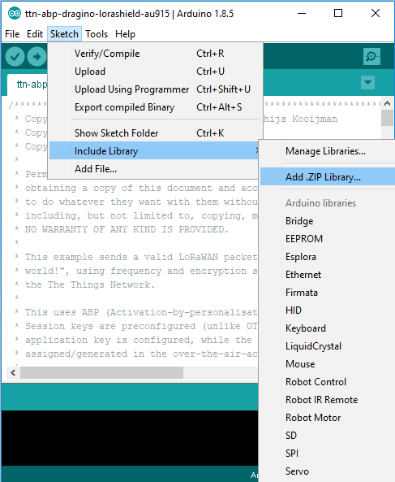
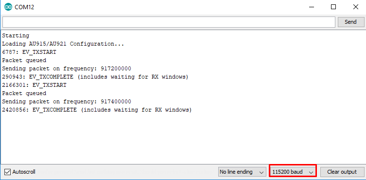
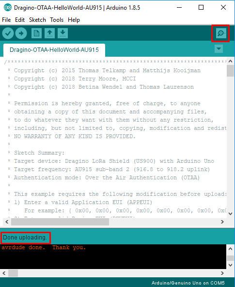

# AdafruitFeather32u4-ABP-ClassroomSensor-AU915

### Configuring an Adafruit Feather 32u4 for use on the AU915 frequency 

<br />

<br />

## Preparation

- Download and install the Arduino IDE. You can download it from [here](https://www.arduino.cc/en/Main/Software). Make sure you have version 1.8 (or above) of the Arduino IDE.
- Download and install the elapsedMillis library. You can download it from [here](https://github.com/pfeerick/elapsedMillis).
- Download and install the Adafruit sensor library. You can download it from [here](https://github.com/adafruit/Adafruit_Sensor).
- Download and install the DHT sensor library. You can download it from [here](https://github.com/adafruit/DHT-sensor-library).

## Arduino IDE Setup

- Start the Arduino IDE and navigate to the Preferences menu


- Copy and paste the link below into the Additional Boards Manager URLs option in the Arduino IDE preferences and click OK to save the new preferences settings

`https://adafruit.github.io/arduino-board-index/package_adafruit_index.json`


- Open the Boards Manager by navigating to the _Tools->Board_ menu



- Install the latest Adafruit AVR Boards


- Quit and reopen the Arduino IDE to ensure that all of the boards are properly installed

## Required hardware

- Adafruit Feather 32u4 LoRa RFM9x
- Breadboard
- Antenna - 3 inches or 7.8 cm
- wires: 1 yellow, 1 black, 1 red and 1 green
- DHT22
- 4.7K - 10K resistor


## Download the Arduino-LMIC library

- Open a web browser and navigate to the [MCCI Arduino-LMIC library](https://github.com/thomaslaurenson/arduino-lmic) repository
- Click on the _Clone or Download_ button
- Select _Download ZIP_

<br />

<br />

## Add the MCCI Arduino-LMIC library to the _libraries_ directory of your Arduino IDE installation

- Open Arduino IDE
- Navigate to _Sketch_, _Include Library_, _Add .ZIP Library_
- Find the ZIP file, and select Open

<br />

<br />

## Connecting it up

To send message you need to add two connections on the Feather board, and an antenna. The connections needed are:

<br />

<br />

## Adding the Example Sketch 

- Add the provided sketch for the Adafruit Feather 32u4 from the `code` folder into the Arduino Sketchbook folder (both files into the same folder).

<br />

<br />

The example sketch is provided in the `code` directory. The sketch is named:

<br />

```
AdafruitFeather32u4-ABP-ClassroomSensor-AU915.ino
```

```
dtostrf.h 
```

<br />

- Make sure to put the sketch (`.ino` file) into a folder with the same name.

<br />

<br />

- Open the sketch for your device
- Set the ABP Keys

Make sure you remember to **change the ABP properties in the sketch file**. You need to replace the `FILLMEIN` placeholders with a valid Network Session Key (NWKSKEY), Application Session Key (APPSKEY) and Device Address (DEVADDR). The block of code is displayed for reference below.


<br />

```
// LoRaWAN NwkSKey, network session key
static const PROGMEM u1_t NWKSKEY[16] = { FILLMEIN };

// LoRaWAN AppSKey, application session key
static const u1_t PROGMEM APPSKEY[16] = { FILLMEIN };

// LoRaWAN end-device address (DevAddr)
// See http://thethingsnetwork.org/wiki/AddressSpace
// The library converts the address to network byte order as needed.
static const u4_t DEVADDR = FILLMEIN; // <-- Change this address for every node!
```
<br />

For example, if you have the following keys:

```
NWKSKEY: 07f319fc you will enter 0x07f319fc
APPSKEY: d954cebe9b5b762d566c94d8222f3ad you will enter 0xd9, 0x54, 0xce, 0xbe, 0x9b, 0x5b, 0x76, 0x2d, 0x56, 0x26, 0xc9, 0x4d, 0x82, 0x22, 0xf3, 0xad
DEVADDR: e407e33beff3806c7c6e4243567c2237 you will enter 0xe4, 0x07, 0xe3, 0x3b, 0xef, 0xf3, 0x80, 0x6c, 0x7c, 0x6e, 0x42, 0x43, 0x56, 0x7c, 0x22, 0x37
```

- Change the COM port to the attached device

<br />

<br />

- Select the _Adafruit Feather 32u4_ board (not the _Express_ one) by navigating to the _Tools->Board_ menu


- The sketch is ready to be compiled and uploaded by clicking on _Upload_. Then wait until it shows _Done uploading_ at the bottom

<br />


<br />

## Checking Functionality

- Make sure you have the correct COM port selected
- Make sure you have the right board selected
- Check if the Serial Monitor is set to `1152000`

<br />


<br />

- Click on _Serial Monitor_ when _Done uploading_ is shown at the bottom

<br />

<br />	

- You should see output similar to the listing below:


<br />

```
Starting...
Loading AU915/AU921 Configuration...
Temperature: 25.90 *C
Humidity 49.90
VBat: 6.54
331401: EV_TXSTART
Packet queued
Sending packet on frequency: 916800000
Sleeping for 300 seconds
2929274: EV_TXCOMPLETE (includes waiting for RX windows)
Temperature: 26.60 *C
Humidity 40.30
VBat: 6.41
21697765: EV_TXSTART
Packet queued
Sending packet on frequency: 917800000
Sleeping for 300 seconds
24309399: EV_TXCOMPLETE (includes waiting for RX windows)

```
<br />


