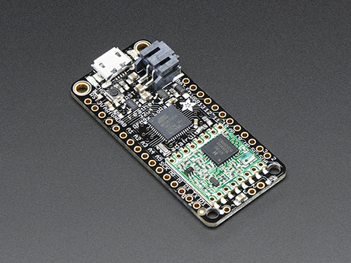

# CO2-monitor
Our client is Polytechnic Energy manager, Neville Auton.  The concept of this project is to provide CO2 level data within different locations around the campus as the way to enhance air quality in the working environment for students.  Indoor air pollution with high level of carbon dioxide can affect the ability of our brain functionality and have a long term health impact.  CO2 can be measured in Parts-Per-Million or known as **ppm**.  According to the Kane International Limited 2019, the image below illustrates the meaning of CO2 level.


All code can be found [here.](https://gitlab.com/iotop/room-sensors/-/tree/master/node/co2-monitor/CO2).  There are two different folders here; one for a standalone co2 sensor as we have initially developed the device without any integration to Room Sensor Project.  Later we have added CO2 project as a part of Room Sensor Project displaying Co2 result on Heatmap web application.


# Node

This project is developed using:

## Adafruit Feather 32u4


More information about [Adafruit Feather 32u4 RFM9x LoRa Radio](https://learn.adafruit.com/adafruit-feather-32u4-radio-with-lora-radio-module/overview)


## MH-Z19B C02 Sensor


More information about [MH-Z19B CO2 Sensor.](https://gitlab.com/iotop/room-sensors/-/blob/master/node/co2-monitor/MH-Z19B_CO2_Sensor.pdf)

There are three different types of output signals using MHZ19B sensor.  The current working prototype is using PWM pin to receive electric pulse level to calculate CO2 level.  


# Steps to create a node

## Hardware

- Wire CO2 device according to this [diagram](https://gitlab.com/iotop/room-sensors/-/blob/master/node/co2-monitor/CO2/CO2_PWM.png)

## Set up Arduino IDE
- Start the Arduino IDE and navigate to the Preferences menu.


- Copy and paste the link below into the Additional Boards Manager URLs option in the Arduino IDE preferences and click OK to save the new preferences settings. `https://adafruit.github.io/arduino-board-index/package_adafruit_index.json`


- Open the Boards Manager by navigating to the _Tools->Board_ menu.


- Install the latest Adafruit AVR Boards.


- Quit and reopen the Arduino IDE to ensure that all of the boards are properly installed.

## Enable Radio frequency

- Navigate to **Arduino library folder**.  It is usually on the __Document folder__ >> __Arduino__ >> __library__.

- Locate TinyLora library folder.  Open **TinyLora.h** file with your preferred code editor.  Search for a list of __'Region Configuration'__ and **uncomment `#define AU915`** to enable Australasia region and ensure other regions are commented.  

- Save the file and close Arduino IDE and reopen IDE.


## TTN device registration

(Please add your device to TTN application corresponding to the requirement, roomsensor_dev is mainly used for development purpose.)

- [Register your device](https://console.thethingsnetwork.org/applications/op_c02/devices/register) on TTN using the IoT team credential from sensitive repository to log in.  Ensure to select the CO2 application before registering a new device.  TTN will automatically generate Network keys, application keys and device keys before finishing off the registration.    

-  Go to **Settings** tab, look for **Activation Method** and select **ABP** and ensure to select **16 bit** on the **Frame Counter Width** and **Uncheck Frame Counter Checks** and save your settings.


## Change credential

- Go to Arduino IDE and open .ino type file and ensure to change network key, device key and application key on your sketch according to the dedicated hex address given by TTN.


-  Transfer file to Adafruit device through serial port, select the correct port and board from the available list.

-  A successful set up will display your device on TTN application device.  


# Troubleshoot

- A status for 'never seen' device on TTN for the registered device, could be a sign of mismatched credential or AU915 region is still commented.  

- Inconsistent packets received on TTN could be an indication of the device is too far away from the gateway.  Check if RAK_Rooftop received all packets from your device, adding antenna on the device could help extend the range.

- Ensure you are within range of at least one gateway for device to connect and send / receive packets.  


# The Things Network Decoder
The things network allows you to set a payload formats so that API can extract readable data from TTN using 'payload_fields' to avoid any unnecessary base64 data conversion.  Co2 devices subscribed under Room Sensor application are programmed to send data in Char type in order to keep consistency with readability of data for Room sensor incoming data to our Database Server.  Our ingest file is currently allowing base64 conversion before data going to our database for Room Sensor and Orokonui.


```
function Decoder(bytes, port) {
  var decoded = {}
  if (port === 1)
  {
     // Split bytes from string
      var celciusSlice = String.fromCharCode.apply(null, bytes.slice(3, 8));
      var humidSlice = String.fromCharCode.apply(null, bytes.slice(15, 20));
      var battSlice = String.fromCharCode.apply(null, bytes.slice(26, 30));
      
      // Convert string to float
      decoded.celsius = parseFloat(celciusSlice);
      decoded.humid = parseFloat(humidSlice);
      decoded.batt = parseFloat(battSlice);
     
      return decoded;
  }
  else
  {
    //slice raw payload to retrieve ppm value
    var ppm2Slice = String.fromCharCode.apply(null, bytes.slice(0,5));
    
    //convert to Integer
    decoded.ppm2 = parseInt(ppm2Slice)
    
    return decoded;
  }
    
}
```
The code above produced the following outcome in TTN Data tab for the application.


