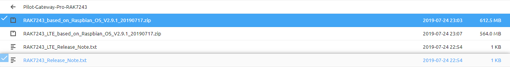
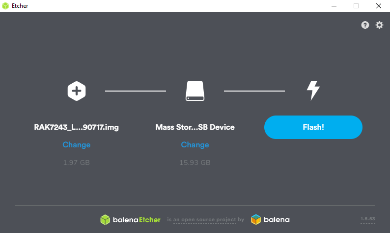

# Setting Up the RAK7243 Gateway

Setting up the RAK7243 Gateway is a simple process, requiring the image to be flashed to the provided MicroSD card, before altering some settings on the device so that it's ready for use.

## Flashing the Image for the Gateway

In order to use the gateway, you will need to flash the provided MicroSD card to have the Raspberry Pi image on the device. The website to download the image is provided on the box of the
microSD card, however if the box is missing. The image can be found [Here](https://downloads.rakwireless.com/en/LoRa/Pilot-Gateway-Pro-RAK7243/Firmware/)



The image you want to download is the zip file named "RAK7243_based_on_Rasbian_OS" or similar. Be aware, you don't want to download the LTE zip file!

Once you've downloaded the required zip file, you will need to download imaging software, since the default windows imaging software won't work with the image. I recommend using balenaEtcher for this, found [Here](https://www.balena.io/etcher/)

Once you have balenaEtcher Installed, launch it, make sure you've plugged in the microSD card, and then select the RAK7243 image on your computer, then select the microSD card, then click "Flash"



Once the image is flashed and validated, you can remove it from your PC, and install it into the gateway's designated spot on the same side as the antennas. 

## Configuring the Gateway

In order to have the gateways configured for our uses, there's just a few changes you need to do to the device's config. Ideally, you'll want to plug the device into power, a monitor and a keyboard. However, the default OS will broadcast a WiFi AP with SSH access. 

#### SSH (WiFi)

If you choose to connect via SSH, you'll need to find the SSID named "Rakwireless_XXXX". You can connect to this AP with the password "rakwireless". `We'll need to change this for security purposes later.` Your device will automatically pick up an IP address from this AP via DHCP. The default IP address for the gateway is `192.168.12.1`.

You can now SSH into the gateway with the default username and password shown below. 


#### Physical Access

The device should automatically power on and display a bunch of messages on your screen about services starting up and giving feedback to the left of the messages.
Once these messages end, the device will prompt you for a login. The login details for the default raspberry pi device are as follows:

```
Login: pi
Password: raspberry
```

Once you've logged in, you will need to run the following command to get to the config

`sudo raspi-config`

This will bring you to a BIOS-like GUI, which you can navigate with your keyboards arrow keys. From there, you will first want to change the password for the gateway. Select
"Change User Password" From the list, you will be prompted that you're about to change the password, press enter, and then enter the new password.
The recommended passwords for our project are found in the sensitive repository.

Once the password is changed, you will also need to change the device's Wi-Fi country. To do this, navigate the menu to "Localization Options", and then select "Change Wi-fi Country"
Navigate to "New Zealand" which will be the last option under "N", since the list is sorted by the abbreviations. Once NZ is highlighted, press Enter.

To navigate back to the terminal view, press the right arrow key when on the Configuration menu. Press it again to highlight "Finish" and then press Enter.

### Gateway Settings

After changing the password for the gateway, it's time to configure the packet forwarder. Once back at the terminal, type `sudo gateway-config`. 
This will take you to another menu based interface. 

1. Using your arrow keys scroll down to option 2, "Setup RAK Gateway LoRa Concentrator". 
2. When prompted for the server plan, select option 1, "TTN"
3. When prompted for the channel plan, select option 2, "AU_915_928"
4. Dismiss the following information boxes, you're done!

### WiFi AP Settings

Assuming you've just changed the gateway settings you should now change the access point SSID and password for security purposes. You should be back in the gateway configuration options, 
if not, type `sudo gateway-config`.

1. Select option 5, "Configure WiFi"
2. Select option 3, "Modify SSID and PW for AP mode"
3. When prompted for the new SSID, type in the name of the gateway (this should be labelled on the side)
4. When prompted for the password, type in the recommended WiFi password found in the sensitive directory
5. Quit the gateway configuration options window
6. Reboot the gateway using `sudo reboot now`

You'll need to connect to the new SSID with the new password in order to get back into your SSH session. 

### DHCP Configuration

Finally, you need to reset the DHCP configuration on the device. We have a default configuration file on git. Use the following commands to download and enable it. 

`sudo wget https://gitlab.op-bit.nz/BIT/Project/Internet-Of-Things/gateways/raw/master/RAK7243-TTN-Gateway/dchpcd.conf -o /etc/dhcpcd.conf`

`sudo reboot now`

### Register on The Things Network

1. Navigate to https://console.thethings.meshed.com.au/ and log in using the credentials in the sensitive repo. 
2. Click on the "Gateways" link.
3. Click "register gateway"
4. Check the "I'm using the legacy packet forwarder" box
5. In order to get the gateway ID you'll need access to the gateway you're trying to register, either via SSH or with physical access. Once in the bash console, type `gateway-version` and you'll be presented with the gateway ID. 
6. Paste or type the gateway ID into the TTN register form.
7. For the description, simply type the name of the gateway as found on it's label. 
8. For the frequency plan, we use "Australia 915MHz"
9. For the router option, we use the "meshed-router" as it's based in Australia and is the same handler we use for our applications.
10. Feel free to set the location, altitude and antenna placement if known at the time. These values can be changed later. 
11. Click "Register Gateway" to submit your details, if everything has been done correctly you should begin seeing data coming from your gateway. 

For now, that's it. The gateway should be set up for the Things Network!